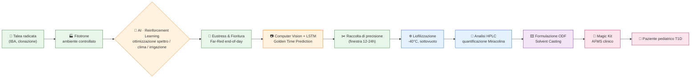
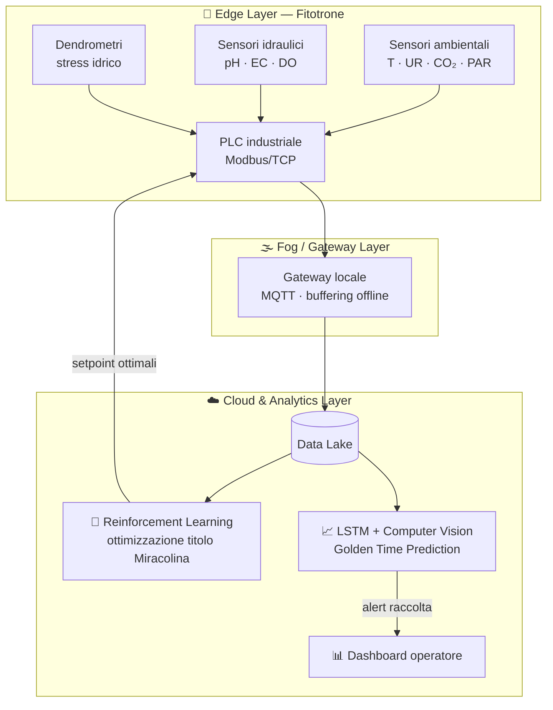
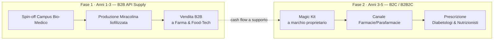
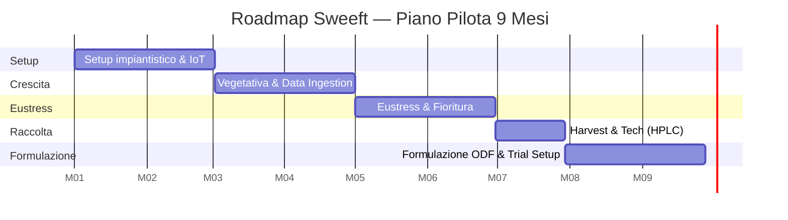

### Precision Pharming: dalla resilienza agronomica al Novel Food clinico

**Trasformiamo una bacca tropicale instabile in un farmaco alimentare di precisione, coltivato indoor e guidato dall'intelligenza artificiale.**

[Il Problema](#-il-problema) · [La Soluzione](#-la-soluzione) · [Come Funziona](#-come-funziona) · [Tecnologia](#-architettura-digitale--ai) · [Business](#-business-model--go-to-market) · [Roadmap](#-roadmap-operativa) · [KPI](#-kpi-di-successo) · [Team](#-team--know-how) · [Contatti](#-contatti)

---

## 🍒 Il Progetto

**Sweeft** è un progetto industriale e di ricerc, che si posiziona all'intersezione tra **biotecnologia agraria**, **ingegneria dei dati** e **nutrizione clinica**.

Utilizziamo i fitotroni (camere di coltivazione in ambiente totalmente controllato) per ingegnerizzare la produzione del *Synsepalum dulcificum* (**Miracle Berry**) e standardizzare l'estrazione della **Miracolina**, una glicoproteina capace di trasformare la percezione del gusto da acido a dolce, senza zuccheri e senza impatto glicemico.

L'obiettivo finale è un **Alimento a Fini Medici Speciali (AFMS)** — un film orosolubile (**ODF**) — indirizzato prioritariamente alla **pediatria diabetologica (T1D)**, per azzerare il carico glicemico e psicologico legato alla deprivazione alimentare.

---

## 🚨 Il Problema

La supply chain botanica tradizionale delle molecole funzionali tropicali è strutturalmente inefficiente:

| Criticità | Impatto |
|---|---|
| 🌦️ Stress abiotico incontrollato in campo aperto | Il titolo di Miracolina varia **fino al 65%** tra un raccolto e l'altro |
| ⏱️ Alto tasso di respirazione post-raccolto | Il frutto fresco degrada in **~72 ore** |
| ❄️ Assenza di cold-chain nei paesi di origine | **Fino al 40%** di scarto logistico (food waste) |
| 💊 Limiti degli edulcoranti intensivi attuali | Alterazione del microbiota, retrogusto sgradito, nessuna soluzione dedicata ai bambini T1D |

**Risultato:** un ingrediente prezioso, clinicamente promettente, ma impossibile da industrializzare con gli standard EFSA richiesti per un Novel Food di grado clinico.

---

## 💡 La Soluzione

**Sweeft** converte l'agricoltura in **Pharming**: la pianta non è il fine, ma il bioreattore naturale in cui sintetizzare in modo controllato e ripetibile la molecola bersaglio.

- 🏭 **Precision Pharming indoor** — coltivazione in fitotrone, indipendente da clima e geografia
- 🤖 **AI-driven optimization** — Reinforcement Learning e Computer Vision guidano la crescita e il momento esatto della raccolta
- ❄️ **Stabilizzazione a freddo** — liofilizzazione sottovuoto per preservare la struttura della glicoproteina
- 🎞️ **Delivery clinico** — film orosolubile (ODF) a dissoluzione rapida, pensato per pazienti pediatrici

---

## 🔄 Come Funziona

Il processo end-to-end, dalla talea al paziente:

### Ingegneria agronomica in camera fitotronica

| Parametro | Fase Vegetativa | Fase Fioritura/Fruttificazione |
|---|---|---|
| pH soluzione | 4.5 – 5.0 | 4.5 – 5.0 |
| EC (conducibilità) | 0.8 mS/cm | 1.2 mS/cm |
| Rapporto N:K | 2:1 | 1:2.5 |
| Temperatura aria | 28°C giorno / 24°C notte | 29°C giorno / 22°C notte |
| Umidità (VPD) | 75% (~0.9 kPa) | 85% (~0.6 kPa) |

Sistema idroponico a goccia a ciclo chiuso (leachate ricircolato e sterilizzato UV-C), substrato 60% fibra di cocco + 40% perlite, illuminazione LED a spettro dinamico (blu in fase vegetativa → rosso/far-red per l'induzione della sintesi proteica).

---

## 🧠 Architettura Digitale & AI

Il fitotrone diventa un **sistema cognitivo**: dati in tempo reale alimentano modelli di AI che chiudono il ciclo di ottimizzazione senza logiche a regole fisse.

- **Reward Function (RL):** massimizzazione del titolo di Miracolina per grammo di peso fresco (dato HPLC)
- **Predictive Harvesting:** LSTM + analisi colorimetrica RGB/multispettrale per individuare la finestra ottimale di raccolta (12-24h)
- **Resilienza:** il gateway locale garantisce operatività *mission-critical* anche in assenza di connettività cloud

---

## 🧪 Dalla Pianta al Farmaco: Tecnologia Alimentare

1. **Depolpatura a 4°C** — separazione della polpa da semi e buccia (fenoli/tannini indesiderati)
2. **Liofilizzazione sottovuoto** a -40°C, < 1 mbar — sublimazione dell'acqua, Aw < 0.2, proteina intatta
3. **Formulazione ODF (Orally Disintegrating Film)** — matrice in HPMC/Pullulano, spessore 50-100 µm, dissoluzione salivare **< 15 secondi**
4. **Shelf-life > 24 mesi** a temperatura ambiente in blister anti-umidità

---

## 🩺 Protocollo Clinico

Il **"Magic Kit"** combina attivazione e nutrizione in due fasi:

Il trial pilota, in collaborazione con la diabetologia pediatrica, misura tre endpoint:

- **Metabolico** — glicemia interstiziale (CGM) post-prandiale, nessun picco insulinico
- **Nutrizionale** — aumento dell'assunzione di micronutrienti da frutta acida
- **Psicologico** — riduzione del *dietary distress*, aumento dell'aderenza terapeutica

---

## 💼 Business Model & Go-to-Market

**Mercato:**

- **TAM** — Medical Foods & Novel Food funzionali globali (CAGR stimato > 7%/anno)
- **SAM** — Integratori e AFMS per gestione metabolica/diabetologica in Europa
- **SOM** — Pediatria diabetologica T1D e obesità infantile, Italia + UE limitrofa (nicchia, alto margine, spesa out-of-pocket)

**IP Strategy** — il *Synsepalum dulcificum* non è brevettabile in sé; il *moat* competitivo è costruito su:
- 🔒 **Trade secret** — algoritmi ML, Digital Twin climatico, curve di fotobiologia LED
- 📜 **Brevetto di processo** — combinazione liofilizzazione a freddo + matrice polimerica ODF

---

## 🗺️ Roadmap Operativa

Piano pilota di 9 mesi:

| Mese | Milestone |
|---|---|
| 1-2 | Setup idraulico fitotrone, calibrazione IoT, quarantena talee, avvio database cloud |
| 3-4 | Crescita vegetativa, test cicli LED, training anomaly detection |
| 5-6 | Switch fotoperiodico, eustress Far-Red, allegagione, prima spettroscopia |
| 7 | Predictive Harvesting → raccolta → liofilizzazione → analisi HPLC |
| 8-9 | Prototipi ODF, test reologici/dissoluzione, sottomissione comitato etico |

---

## 📊 KPI di Successo

| Categoria | Metrica | Target Sweeft | Benchmark tradizionale |
|---|---|---|---|
| Tecnologico-Agronomico | Standardizzazione bio-chimica | Dev. standard < 5% tra 3 lotti | Variabilità outdoor 40-60% |
| Tecnologico-Agronomico | Efficienza idrica | > 85% riduzione uso acqua | Nessun recupero in campo aperto |
| Tecnologico-Agronomico | Latenza sistema IoT | < 2s per correzione parametri critici | Controllo manuale o assente |
| Logistico-Operativo | Food waste post-raccolto | 0% scarto pre-lavorazione | Fino al 40% perdita cold-chain |
| Logistico-Operativo | Shelf-life prodotto finito | > 95% efficacia recettoriale a 12 mesi | Degradazione frutto fresco in 3 giorni |
| Clinico-Strategico | Validazione ODF | Dissoluzione salivare < 15s | Compresse liofilizzate > 1-2 min |
| Clinico-Strategico | Cost-to-serve (B2B) | Break-even entro il 18° mese | N/A |

---

## 👥 Team & Know-How

| Ruolo | Focus |
|---|---|
| 🌱 Agronomo | Fitobiologia, idroponica, gestione fitotrone |
| 🤖 AI/ML Engineer | Reinforcement Learning, LSTM, Computer Vision, IIoT |
| 🧪 Tecnologo R&D | Liofilizzazione, formulazione ODF, HPLC |
| 🩺 Nutrizionista Clinico | Design trial, protocolli AFMS, endpoint clinici |

---

## 📚 Approfondimenti

- [`docs/architecture.md`](docs/architecture.md) — Architettura IIoT e modelli di Machine Learning
- [`docs/business-model.md`](docs/business-model.md) — Mercato, go-to-market e proprietà intellettuale
- [`docs/clinical-protocol.md`](docs/clinical-protocol.md) — Protocollo clinico e target pediatrico
- [`docs/roadmap.md`](docs/roadmap.md) — Milestone dettagliate e KPI

---

## 📬 Contatti

Interessato a collaborare, investire o co-sviluppare il progetto **Sweeft**? Apri una [Issue](../../issues) o contatta il team:

**Sweeft** — *Dalla foresta pluviale al fitotrone, dal dato alla clinica.*

