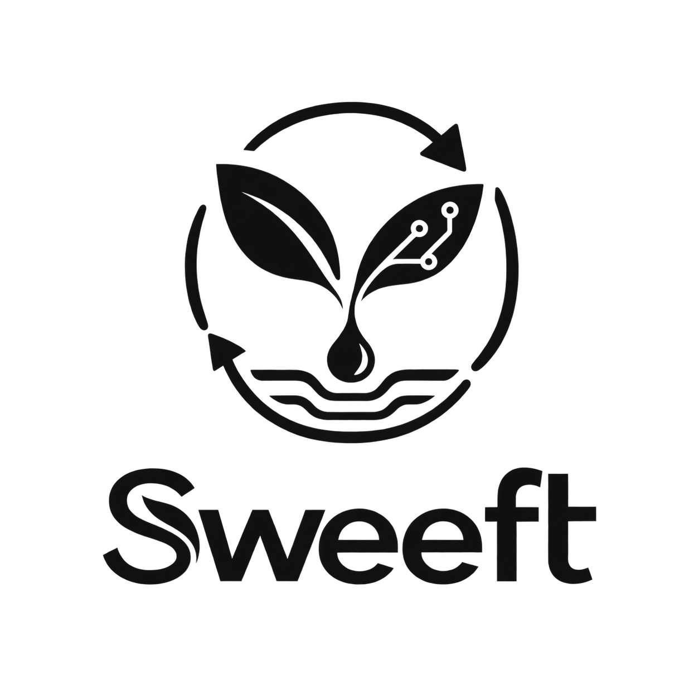
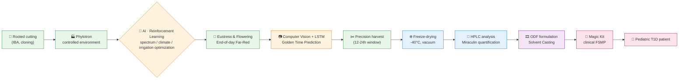
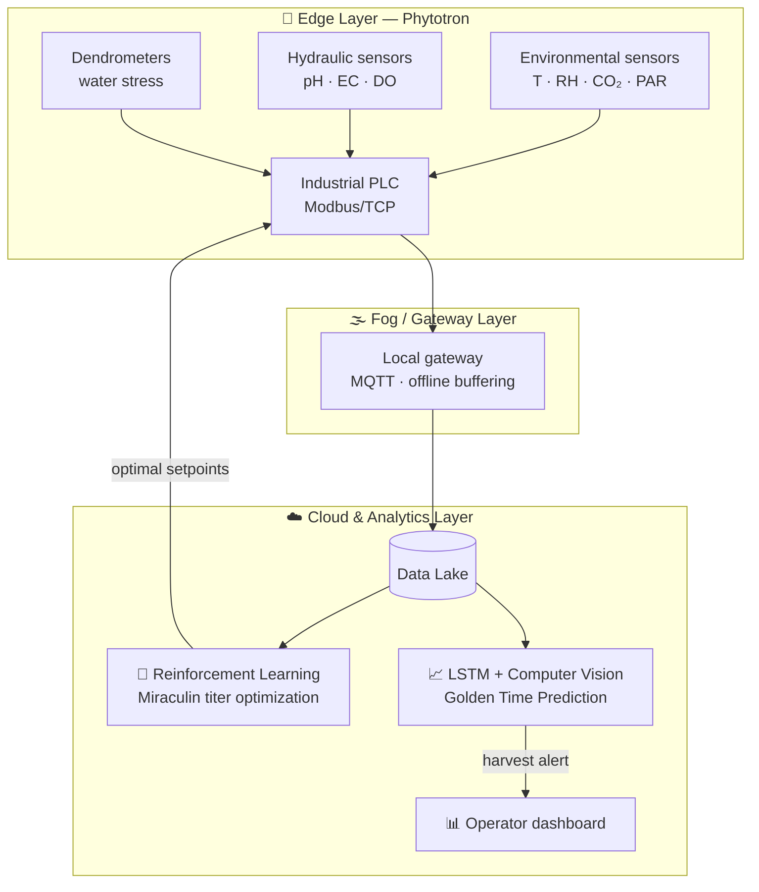
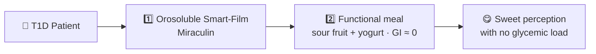
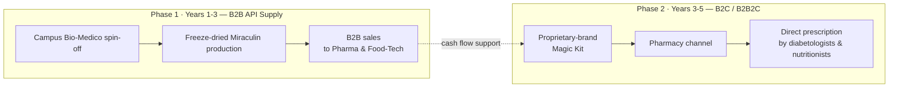
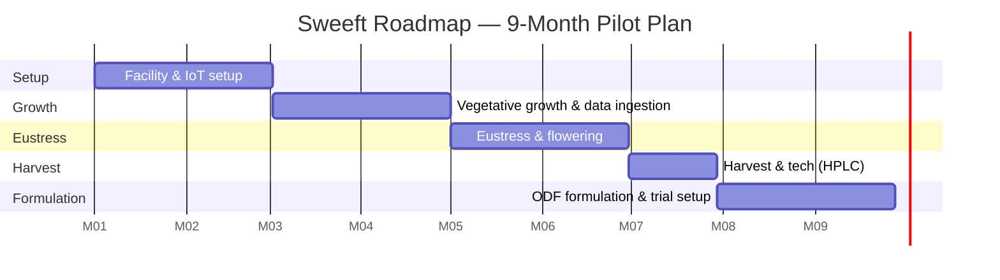

**[🇬🇧 English](README.md) · [🇮🇹 Italiano](README.it.md)**

### Precision Pharming: from agronomic resilience to clinical Novel Food

**We turn an unstable tropical berry into a precision food-drug, grown indoors and driven by artificial intelligence.**

[The Problem](#-the-problem) · [The Solution](#-the-solution) · [How It Works](#-how-it-works) · [Technology](#-digital-architecture--ai) · [Business](#-business-model--go-to-market) · [Roadmap](#%EF%B8%8F-operational-roadmap) · [KPI](#-success-kpis) · [Team](#-team--know-how) · [Contact](#-contact)

---

## 🍒 The Project

**Sweeft** is an industrial and research project at the intersection of **agricultural biotechnology**, **data engineering** and **clinical nutrition**.

We use phytotrons (fully controlled-environment growth chambers) to engineer the production of *Synsepalum dulcificum* (**Miracle Berry**) and standardize the extraction of **Miraculin**, a glycoprotein capable of shifting taste perception from sour to sweet, with no added sugar and no glycemic impact.

The end goal is a **Food for Special Medical Purposes (FSMP)** — an orally disintegrating film (**ODF**) — primarily targeted at **pediatric diabetology (T1D)**, to eliminate the glycemic and psychological burden of dietary deprivation.

---

## 🚨 The Problem

The traditional botanical supply chain for functional tropical molecules is structurally inefficient:

| Issue | Impact |
|---|---|
| 🌦️ Uncontrolled abiotic stress in open fields | Miraculin titer varies by **up to 65%** between harvests |
| ⏱️ High post-harvest respiration rate | Fresh fruit degrades within **~72 hours** |
| ❄️ No cold-chain infrastructure at origin | **Up to 40%** logistic waste (food waste) |
| 💊 Limits of current intensive sweeteners | Gut microbiota disruption, unpleasant aftertaste, no dedicated solution for T1D children |

**Result:** a valuable, clinically promising ingredient that cannot be industrialized to the EFSA standards required for a clinical-grade Novel Food.

---

## 💡 The Solution

**Sweeft** turns agriculture into **Pharming**: the plant is no longer the end product, but the natural bioreactor in which to synthesize the target molecule in a controlled, repeatable way.

- 🏭 **Indoor Precision Pharming** — phytotron cultivation, independent of climate and geography
- 🤖 **AI-driven optimization** — Reinforcement Learning and Computer Vision guide growth and the exact harvesting moment
- ❄️ **Cold stabilization** — vacuum freeze-drying to preserve the glycoprotein's structure
- 🎞️ **Clinical delivery** — fast-dissolving orally disintegrating film (ODF), designed for pediatric patients

---

## 🔄 How It Works

The end-to-end process, from cutting to patient:

### Agronomic Engineering in the Phytotron

| Parameter | Vegetative Stage | Flowering/Fruiting Stage |
|---|---|---|
| Solution pH | 4.5 – 5.0 | 4.5 – 5.0 |
| EC (conductivity) | 0.8 mS/cm | 1.2 mS/cm |
| N:K ratio | 2:1 | 1:2.5 |
| Air temperature | 28°C day / 24°C night | 29°C day / 22°C night |
| Humidity (VPD) | 75% (~0.9 kPa) | 85% (~0.6 kPa) |

Closed-loop drip hydroponic system (leachate recirculated and UV-C sterilized), 60% coconut coir + 40% perlite substrate, dynamic-spectrum LED lighting (blue in the vegetative stage → red/far-red to induce protein synthesis).

---

## 🧠 Digital Architecture & AI

The phytotron becomes a **cognitive system**: real-time data feeds AI models that close the optimization loop without fixed-rule logic.

- **Reward Function (RL):** maximize Miraculin titer per gram of fresh weight (HPLC lab data)
- **Predictive Harvesting:** LSTM + RGB/multispectral colorimetric analysis to identify the optimal harvest window (12-24h)
- **Resilience:** the local gateway ensures mission-critical operations even without cloud connectivity

---

## 🧪 From Plant to Drug: Food Technology

1. **Mechanical depulping at 4°C** — separating pulp from seeds and skin (unwanted phenolics/tannins)
2. **Vacuum freeze-drying** at -40°C, < 1 mbar — water sublimation, Aw < 0.2, intact protein
3. **ODF formulation (Orally Disintegrating Film)** — HPMC/Pullulan matrix, 50-100 µm thickness, salivary dissolution **< 15 seconds**
4. **Shelf-life > 24 months** at room temperature in moisture-proof blister packs

---

## 🩺 Clinical Protocol

The **"Magic Kit"** combines activation and nutrition in two steps:

The pilot trial, in collaboration with pediatric diabetology, measures three endpoints:

- **Metabolic** — post-prandial interstitial glucose (CGM), no insulin spike
- **Nutritional** — increased intake of micronutrients from sour fruit
- **Psychological** — reduced dietary distress, improved treatment adherence

---

## 💼 Business Model & Go-to-Market

**Market:**

- **TAM** — Global Medical Foods & functional Novel Food market (estimated CAGR > 7%/year)
- **SAM** — European supplements and FSMP market for metabolic/diabetic management
- **SOM** — Pediatric T1D diabetology and childhood obesity, Italy + neighboring EU countries (niche, high margin, out-of-pocket spending)

**IP Strategy** — *Synsepalum dulcificum* itself is not patentable; the competitive moat is built on:
- 🔒 **Trade secret** — ML algorithms, climate Digital Twin, LED photobiology curves
- 📜 **Process patent** — combination of cold freeze-drying and polymer matrix for the ODF

---

## 🗺️ Operational Roadmap

9-month pilot plan:

| Month | Milestone |
|---|---|
| 1-2 | Phytotron hydraulic setup, IoT sensor calibration, plant material quarantine, cloud database launch |
| 3-4 | Vegetative growth, LED cycle testing, anomaly detection training |
| 5-6 | Photoperiod switch, Far-Red eustress, fruit set, first spectroscopy |
| 7 | Predictive Harvesting alert → harvest → freeze-drying → HPLC analysis |
| 8-9 | ODF prototype batches, rheology/dissolution testing, ethics committee submission |

---

## 📊 Success KPIs

| Category | Metric | Sweeft Target | Traditional Benchmark |
|---|---|---|---|
| Technological-Agronomic | Bio-chemical standardization | Std. deviation < 5% across 3 batches | 40-60% outdoor variability |
| Technological-Agronomic | Water efficiency | > 85% reduction in water use | No water recovery in open field |
| Technological-Agronomic | IoT system latency | < 2s for critical parameter correction | Manual or absent control |
| Logistics-Operations | Post-harvest food waste | 0% pre-processing logistic waste | Up to 40% cold-chain loss |
| Logistics-Operations | Finished product shelf-life | > 95% receptor efficacy at 12 months | Fresh fruit degradation in 3 days |
| Clinical-Strategic | ODF validation | Salivary dissolution < 15s | Freeze-dried tablets > 1-2 min |
| Clinical-Strategic | Cost-to-serve (B2B) | Break-even within month 18 | N/A |

---

## 👥 Team & Know-How

| Role | Focus |
|---|---|
| 🌱 Agronomist | Phytobiology, hydroponics, phytotron management |
| 🤖 AI/ML Engineer | Reinforcement Learning, LSTM, Computer Vision, IIoT |
| 🧪 R&D Food Technologist | Freeze-drying, ODF formulation, HPLC |
| 🩺 Clinical Nutritionist | Trial design, FSMP protocols, clinical endpoints |

---

## 📚 Further Reading

- [`docs/architecture.md`](docs/architecture.md) — IIoT architecture and Machine Learning models
- [`docs/business-model.md`](docs/business-model.md) — Market, go-to-market and intellectual property
- [`docs/clinical-protocol.md`](docs/clinical-protocol.md) — Clinical protocol and pediatric target
- [`docs/roadmap.md`](docs/roadmap.md) — Detailed milestones and KPIs

> 📝 Note: the in-depth documents in `docs/` are currently available in Italian only.

---

## 📬 Contact

Interested in collaborating, investing, or co-developing the **Sweeft** project? Open an [Issue](../../issues) or get in touch with the team:

**Sweeft** — *From the rainforest to the phytotron, from data to the clinic.*

