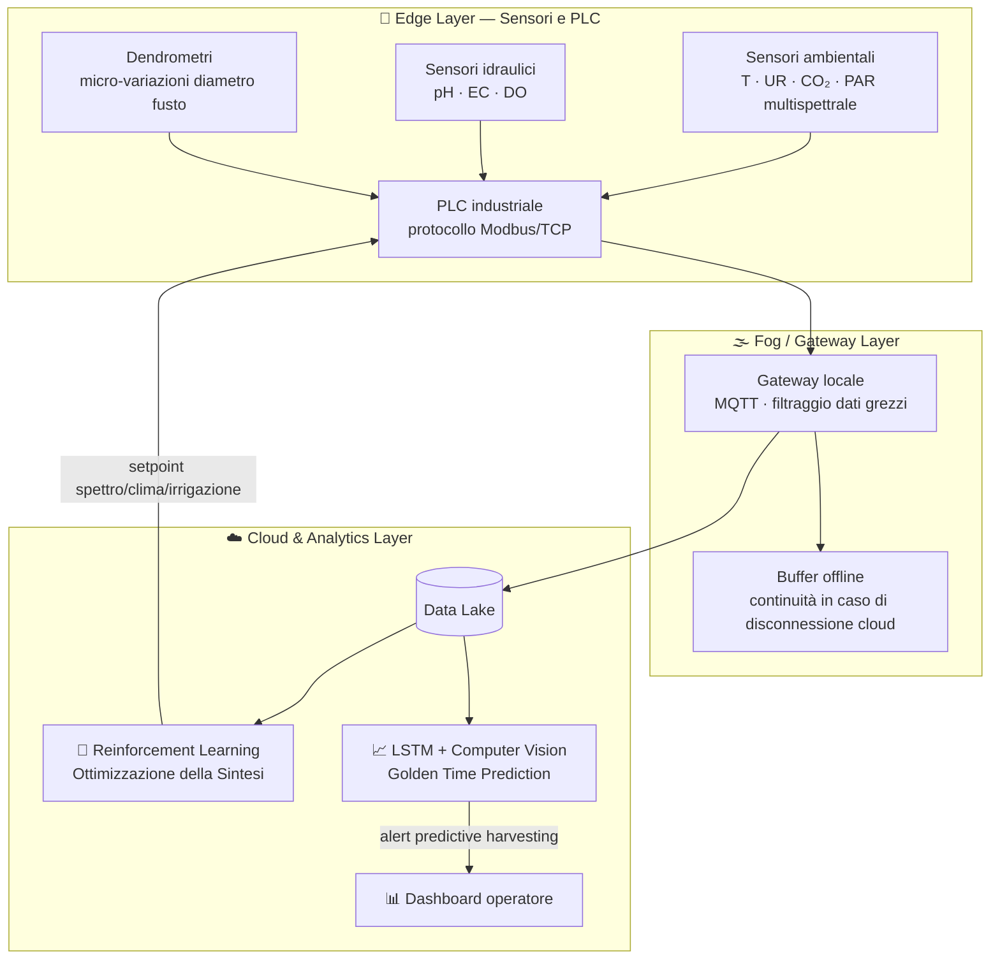

# Architettura Digitale & Machine Learning

Il fitotrone di Sweeft opera come sistema cognitivo a tre livelli, sostituendo il paradigma del "controllo a regole fisse" (IF-THEN) con logiche di auto-apprendimento.

## Topologia IIoT

## Modelli di Machine Learning

### 1. Ottimizzazione della Sintesi (Reinforcement Learning)

- **Reward function:** titolo di Miracolina per grammo di peso fresco (dato periodico HPLC dal laboratorio)
- **Spazio di azione:** micro-variazioni di spettro luminoso, temperatura, curva di irrigazione
- **Obiettivo:** identificare combinazioni multi-variate ottimali che sfuggono all'intuizione agronomica umana

### 2. Golden Time Prediction (Time-Series Forecasting)

- **Modello:** reti neurali ricorrenti (LSTM) integrate con Computer Vision
- **Input:** analisi colorimetrica RGB e multispettrale del viraggio cromatico della bacca (verde → rosso scuro), incrociata con i Gradi Giorno accumulati
- **Output:** alert di *Predictive Harvesting* con finestra di 12-24 ore prima dell'inizio della senescenza

## Principi di resilienza

- Il **gateway locale** garantisce l'autonomia del fitotrone (*mission-critical operations*) anche in caso di perdita di connettività cloud
- Il **Data Lake** conserva lo storico per il retraining periodico dei modelli
