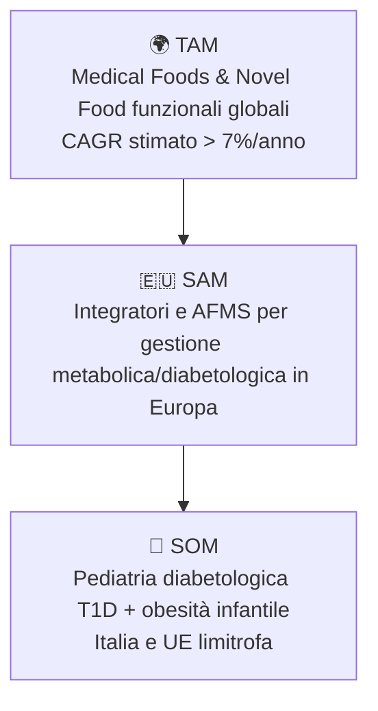
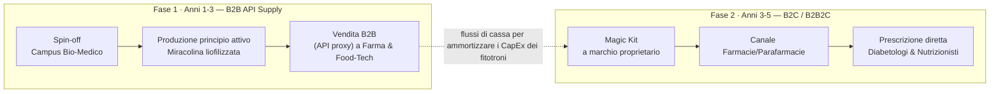

# Business Model & Go-to-Market

## Analisi di Mercato

- **TAM (Total Addressable Market):** mercato globale degli Alimenti a Fini Medici Speciali e dei Novel Food funzionali
- **SAM (Serviceable Available Market):** mercato europeo degli integratori e AFMS per la gestione metabolica e diabetologica
- **SOM (Serviceable Obtainable Market):** segmento della pediatria diabetologica (T1D) e della gestione dell'obesità infantile in Italia e nei paesi UE limitrofi — nicchia ad alto margine, con spiccata propensione alla spesa out-of-pocket

## Revenue Streams

- **Fase 1 — B2B API Supply (anni 1-3):** il Campus Bio-Medico, tramite spin-off, produce e vende l'ingrediente funzionale stabilizzato (polvere liofilizzata di Miracolina) ad aziende farmaceutiche e food-tech, generando flussi di cassa rapidi.
- **Fase 2 — B2C / B2B2C Clinical Kit (anni 3-5):** lancio del "Magic Kit" orosolubile a marchio proprietario, distribuito tramite farmacie/parafarmacie e prescrizione diretta.

## Strategia di Proprietà Intellettuale (IP)

Il *Synsepalum dulcificum* è un elemento botanico naturale e non è brevettabile. La barriera all'ingresso (*moat*) viene costruita tramite:

- **Trade Secret (Know-How):** protezione assoluta dell'algoritmo di machine learning, dei parametri climatici del Digital Twin e delle curve di fotobiologia LED che inducono l'iper-produzione proteica
- **Brevetto Industriale:** deposito di un brevetto di processo che copre la combinazione specifica di liofilizzazione a freddo e matrice polimerica per la realizzazione del film edibile (ODF) a base di Miracolina
