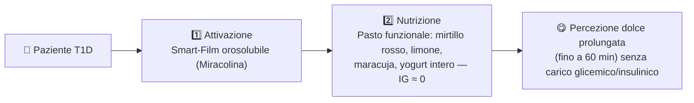

# Protocollo Clinico e Applicazione Pediatrica

## Il "Magic Kit"

Senza l'attivazione della Miracolina, il pasto complementare (ricco di antiossidanti, vitamina C e acidi grassi essenziali) risulterebbe fortemente acido e inappetibile per un bambino.

## Endpoint del Trial Pilota

Il trial, in collaborazione con il reparto di diabetologia pediatrica, misura tre endpoint principali:

| Endpoint | Descrizione |
|---|---|
| **Metabolico** | Monitoraggio continuo (CGM) della glicemia interstiziale nelle 2 ore post-prandiali: assenza totale di picchi glicemici e di risposta insulinica indotta dalla dolcezza (Cephalic Phase Insulin Release) |
| **Nutrizionale** | Aumento dell'assunzione di micronutrienti essenziali (vitamine, polifenoli) da frutti acidi precedentemente esclusi dalla dieta |
| **Psicologico** | Questionari validati su dietary distress e Qualità della Vita (QoL); il meccanismo ludico del "Magic Film" mira ad aumentare l'aderenza terapeutica |

## Perché la Miracolina

- Modulatore allosterico puro sui recettori gustativi **T1R2/T1R3** a pH acido
- Dolcezza percepita fino a **60 minuti**
- Impatto glicemico e insulinico **pari a zero**
- Nessuna alterazione nota del microbiota intestinale (a differenza di sucralosio, acesulfame K, aspartame)
