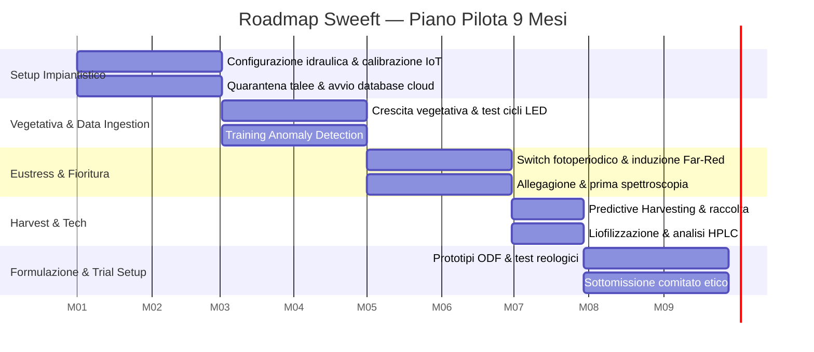

# Roadmap Operativa & KPI

Piano pilota di 9 mesi, secondo le direttive del bando "La Serra che Pensa".

## Diagramma delle Milestone

## Milestone in dettaglio

| Periodo | Attività |
|---|---|
| **Mese 1-2** | Configurazione idraulica del fitotrone, calibrazione della sensoristica IoT, importazione e quarantena del materiale vegetale (talee radicate), avvio del database cloud |
| **Mese 3-4** | Crescita vegetativa, test sui cicli di illuminazione LED, primo training dell'algoritmo di Anomaly Detection sui parametri ambientali base |
| **Mese 5-6** | Switch fotoperiodico e induzione dello stress controllato (Far-Red), allegagione dei frutti, prima misurazione spettroscopica della drupa |
| **Mese 7** | Ricezione dell'alert di Predictive Harvesting dall'AI, raccolta della biomassa, liofilizzazione sottovuoto, analisi HPLC per la quantificazione della Miracolina |
| **Mese 8-9** | Realizzazione dei primi lotti prototipali del film orosolubile (ODF), test reologici e di dissoluzione, sottomissione del protocollo clinico al comitato etico |

## KPI di Successo

| Categoria | Metrica | Target di Progetto | Benchmark Outdoor/Tradizionale |
|---|---|---|---|
| Tecnologico-Agronomico | Standardizzazione bio-chimica | Deviazione standard < 5% del titolo proteico tra tre lotti consecutivi | Variabilità outdoor > 40-60% |
| Tecnologico-Agronomico | Efficienza idrica | > 85% di riduzione dell'uso di acqua (L/Kg biomassa) | Nessun recupero idrico in campo aperto |
| Tecnologico-Agronomico | Latenza sistema IoT | Latenza attuazione < 2s per correzione parametri critici (es. drop pH) | Controllo manuale o assente |
| Logistico-Operativo | Food waste (post-raccolto) | 0% di scarto logistico pre-lavorazione | Fino al 40% di perdita in cold-chain |
| Logistico-Operativo | Shelf-life prodotto finito | Mantenimento > 95% dell'efficacia recettoriale a 12 mesi (temp. ambiente) | Degradazione frutto fresco in 3 giorni |
| Clinico-Strategico | Validazione ODF | Tempo di dissoluzione salivare < 15 secondi | Compresse liofilizzate (> 1-2 minuti) |
| Clinico-Strategico | Cost-to-Serve (B2B) | Break-even operativo del fitotrone entro il 18° mese di produzione | N/A |
